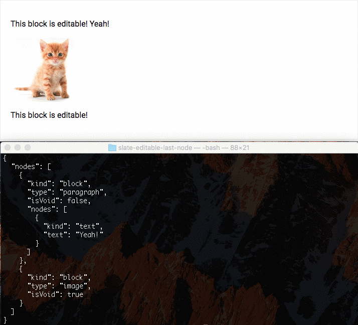

# `slate-editable-last-node`

A Slate plugin that guarantee that editable node will stick at the end of document.


The initial state of document has void node at the bottom.

## Install

```
npm install slate-editable-last-node
```


## Usage

```js
import EditableLastNode from 'slate-editable-last-node'

const plugins = [
  EditableLastNode({
    type: 'line' // Default type is `paragraph`
  })
];
```

#### Arguments
- `type: String` — a type of editable that will be added to the end of paragraph when there void node is appended to the end of the document.


## Development

Clone the repository and then run:

```
npm install
npm watch
```

And open the example page in your browser:

```
http://localhost:8888/
```


## License

The MIT License

Copyright &copy; 2016, [Suwijak Chaipipat](https://github.com/aunsuwijak)

Permission is hereby granted, free of charge, to any person obtaining a copy of this software and associated documentation files (the "Software"), to deal in the Software without restriction, including without limitation the rights to use, copy, modify, merge, publish, distribute, sublicense, and/or sell copies of the Software, and to permit persons to whom the Software is furnished to do so, subject to the following conditions:

The above copyright notice and this permission notice shall be included in all copies or substantial portions of the Software.

THE SOFTWARE IS PROVIDED "AS IS", WITHOUT WARRANTY OF ANY KIND, EXPRESS OR IMPLIED, INCLUDING BUT NOT LIMITED TO THE WARRANTIES OF MERCHANTABILITY, FITNESS FOR A PARTICULAR PURPOSE AND NONINFRINGEMENT. IN NO EVENT SHALL THE AUTHORS OR COPYRIGHT HOLDERS BE LIABLE FOR ANY CLAIM, DAMAGES OR OTHER LIABILITY, WHETHER IN AN ACTION OF CONTRACT, TORT OR OTHERWISE, ARISING FROM, OUT OF OR IN CONNECTION WITH THE SOFTWARE OR THE USE OR OTHER DEALINGS IN THE SOFTWARE.
